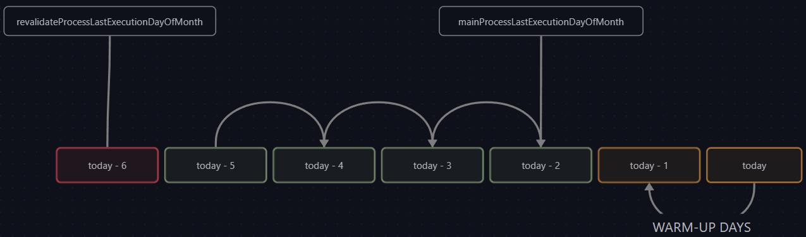
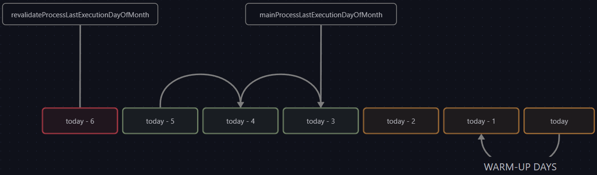
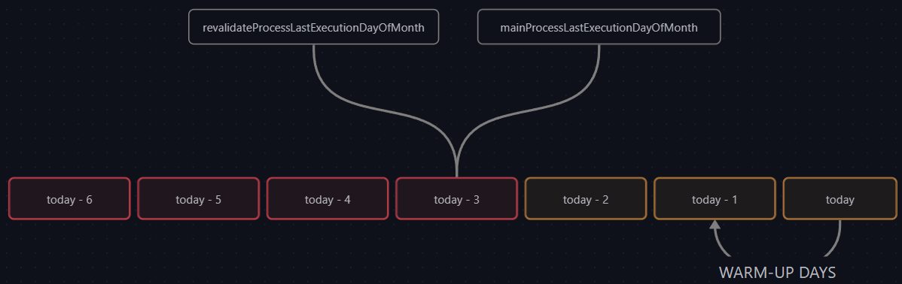

 

  <h2>Coding Test</h2>
  <h3>E1 - Pending Days Calculator for Revalidate Process</h3>

   

  

## 📢 **Brief**

We've a periodic daily process that loads certain accounting information from external sources, but for unknown reason, the source some days doesn't provides the complete information, so our accounting integration systems generates incorrect balance.

Provider said it's systems are ok, and don't give us support for the problem.

Our engineers, investigated further the problem and discovered that the missing information appears one or two days after, so they suggest to create a periodic process that amends the lack of information loading it.

## 📟 **Requirements**

### ✔️ <ins>Consider the assertions below:</ins>

-   Current process will be called "**main process**".
-   New corrective process will be called "**revalidate process**".
-   Days taken by source to expose missing information will be called "**warm-up days**".
-   All dates calculated are **numbers**, "**month days**", and **values are between 1 and 30 inclusively**.
-   **Revalidate process** should be executed **once per day** only.
-   **Oldest** is same as **Lower** when referencing to days of month.

### ✔️ <ins>Implement an algorithm that calculates an array of days pending for revalidate.</ins>

-   <ins>Input arguments:</ins>
    -   **today**: current day of month.
    -   **mainProcessLastExecutionDayOfMonth**: day of month when "main process" loaded the accounting data.
    -   **revalidateProcessLastExecutionDayOfMonth**: day of month when "revalidate process" loaded the missing accounting data in a previous execution.
-   <ins>Constants:</ins>
    -   **WARMUP_DAYS**: always **2**.
-   <ins>Calculated variables:</ins>
    -   **lastNotRevalidatedDayOfMonth**: calculated as **"today" minus "WARMUP_DAYS"**, is the last day of month not revalidated
    -   **startPendingForRevalidateDayOfMonth**: calculated as **"revalidateProcessLastExecutionDayOfMonth" plus 1**, is the oldest day not revalidated.
    -   **lastPendingForRevalidateDayOfMonth**: calculated as the **oldest day between "mainProcessLastExecutionDayOfMonth" and "lastNotRevalidatedDayOfMonth"**, is the newest day not revalidated.
-   <ins>Output:</ins>
    -   array of pending days for revalidate process, calculated as **all days between "startPendingForRevalidateDayOfMonth" and "lastPendingForRevalidateDayOfMonth" inclusively**.
-   <ins>Constraints:</ins>
    -   All calculated days should be **between 1 and 30 inclusively**, if any **zero or negative result** is calculated, an **empty array will be returned**.
    -   **revalidateProcessLastExecutionDayOfMonth** is always older or equal to **mainProcessLastExecutionDayOfMonth**.

### ✔️ <ins>Implement a set of unit tests for the next test cases.</ins>

⚠️ **green** are pending days, **red** are already revalidated days and **yellow** are skipped days because warmup or unprocessed by main process

-   🧪 "revalidateProcessLastExecutionDayOfMonth" is lower than "mainProcessLastExecutionDayOfMonth" and "today" minus "warm-up days" is equal to "mainProcessLastExecutionDayOfMonth".
    
-   🧪 "revalidateProcessLastExecutionDayOfMonth" is lower than "mainProcessLastExecutionDayOfMonth" and "today" minus "warm-up days" is greather than "mainProcessLastExecutionDayOfMonth".
    
-   🧪 "revalidateProcessLastExecutionDayOfMonth" is equal to "mainProcessLastExecutionDayOfMonth" and "today" minus "warm-up days" is greather than "mainProcessLastExecutionDayOfMonth".
    

## 📥 **How to develop**

-   Installs [NodeJS](https://nodejs.org/es/).
-   Execs `npm install`.
-   Execs `npm test`.

---

 

  
  <h2 align="center">ASOCIACIÓN CHILENA DE SEGURIDAD</h2>
  <h3 align="center">Transformación Digital ▪ Equipo de Desarrollo</h3>

